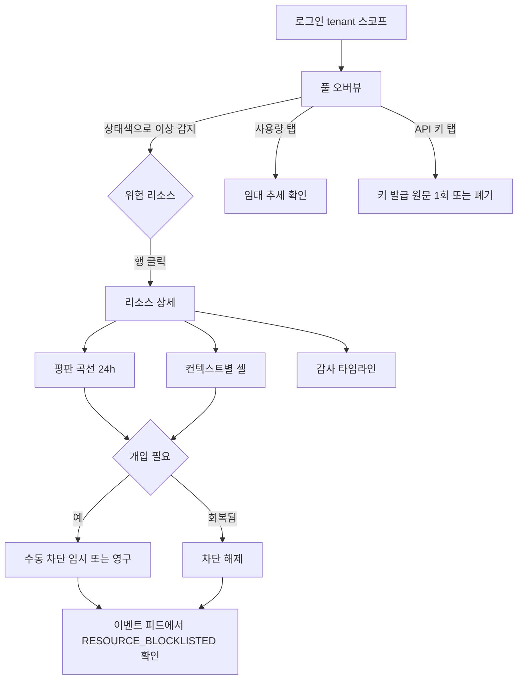

# 대시보드 레퍼런스 — Cloudflare형 운영 콘솔 패턴 분석과 reputation-pool-cloud 적용안

## 0. 분석 목적과 방법론 (먼저 읽어주세요)

reputation-pool-cloud 대시보드(#12, D5)를 "운영자가 신뢰하고 오래 쓰는 콘솔"로 끌어올리기 위해, **Cloudflare
대시보드 같은 성숙한 운영 콘솔의 UX 패턴**을 분석하고 우리 서비스에 매핑한다.

> **⚠️ 근거 범위(정직하게).** **2026-07-18, 일부 화면은 실제 로그인 세션을 라이브로 관찰했다** — 사용자가 직접
> 로그인한 Chrome(별도 프로필, 원격 디버깅)을 Playwright CDP로 attach해 관찰했다. **관찰한 화면**: 계정 홈,
> Workers & Pages, User API Tokens, Audit Logs(§2.9 실관찰 요약). **관찰하지 못한/부분**: 리소스 상세(리소스
> 미보유로 미진입), Analytics(데이터 부족), 계정 Settings 세부 — 이들은 여전히 **패턴 지식·추정**이다.
> 나머지 Cloudflare 서술도 **관례적 SaaS 콘솔 패턴 지식**이며 픽셀·DOM 세부는 **추정**으로 둔다. 반대로
> **reputation-pool-cloud의 API·데이터 모델·현재 화면 구성은 이 저장소에서 직접 확인한 사실**이다.
> 관찰은 **읽기 전용**(파괴적·민감 동작 없음)이었고, 계정 ID·이메일·토큰은 마스킹했으며 **Cloudflare 화면
> 캡처·HTML·CSS·자산은 저장소에 커밋하지 않았다**(분석 텍스트로만 요약).
>
> **제약 준수.** Cloudflare의 HTML/CSS/클래스/DOM·로고·아이콘·이미지 등 독점 자산은 복사하지 않는다. 아래
> 구현안은 전부 우리 데이터 모델에 맞춘 **독립 React/Tailwind 설계**다. 삭제·생성·결제·토큰 발급 등 파괴적/민감
> 동작은 수행하지 않았다.

**스크린샷.** Cloudflare 인증 화면은 관찰·저장하지 않았다(민감정보·독점 자산). `screenshots/`에는 대신 **우리
대시보드 캡처**를 두는 것을 권장한다(생성 방법은 `screenshots/README.md`).

---

## 1. 대상 서비스 현황 (사실 — 저장소 확인)

reputation-pool-cloud는 프록시·계정·세션 같은 **자원(resource)의 평판(reputation)을 관리하는 멀티테넌트 SaaS**의
컨트롤 플레인이다. 대시보드(#12)는 이미 6개 화면이 구현·머지돼 있다.

### 1.1 실제 REST API (컨트롤 플레인, JWT 인증)

| 메서드·경로 | 응답/역할 |
|---|---|
| `POST /api/auth/login` | `{token, tokenType:"Bearer", expiresInSeconds}` — 관리자 로그인, JWT의 `tenant` 클레임이 스코프 |
| `GET /api/pools/resources` | `{summary{registered,blocklisted,totalCells,cellsByState}, resources[]{kind,value,blocked,blockedUntil,blockPermanent,contexts,state,score,recentWindow}}` |
| `GET /api/pools/resources/{kind}/{value}` | `{kind,value,blocked,…, cells[]{context,score,consecutiveFailures,consecutiveSuccesses,windowSize,state,cooldownUntil,updatedAt}}` |
| `GET /api/pools/resources/{kind}/{value}/score-history?hours=24` | `{contexts[]{context, points[]{at,score}}}` — 평판 곡선 |
| `POST /api/pools/resources/{kind}/{value}/block` (`permanent`/`seconds`) · `DELETE …/block` | 수동 차단/해제(운영자 개입) |
| `GET /api/events?page&size` | `{events[]{seq,eventType,resourceKind,resourceValue,context,occurredAt,until,cause},page,size,hasMore}` |
| `GET /api/usage` | `{monthLeaseTotal, poolSize, dailyLeases[]{date,count}}` |
| `GET/POST /api/tenants`, `GET /api/tenants/{id}` | `Tenant{id,name,status,createdAt}` |
| `POST/GET/DELETE /api/tenants/{id}/api-keys[/{keyId}]` | 발급(원문 1회)·목록(prefix 마스킹)·폐기 |
| `GET /actuator/health` (public) | `{status:"UP"...}` |

### 1.2 도메인 enum (사실)
- `ResourceKind` = `PROXY` · `ACCOUNT` · `SESSION`
- `ResourceState` = `HEALTHY`(정상) · `COOLING`(냉각) · `RECOVERING`(회복) · `BLOCKLISTED`(차단)
- 이벤트 타입 = `RESOURCE_LEASED`/`LEASE_RELEASED`/`RESOURCE_COOLED`/`RESOURCE_RECOVERED`/`RESOURCE_BLOCKLISTED`/`RESOURCE_UNBLOCKED`
- 실패 원인 = `CONNECTION_RESET`/`TLS_HANDSHAKE`/`TIMEOUT`/`BLOCKED`

### 1.3 현재 대시보드 구성 (사실)
- 스택: Next.js(App Router) + Tailwind v4 + next-themes(라이트/다크) + recharts. Toss형 아이덴티티.
- 사이드바(**라벨 있는** 세로 내비: 풀 오버뷰·라이브 이벤트·API 키·사용량·관리자) + tenant 칩 + 테마 토글.
- 화면: 오버뷰(KPI+테이블), 리소스 상세(**전체 페이지**, 평판곡선+셀표+감사 타임라인+수동 차단), API 키, 라이브 이벤트(5초 폴링), 사용량(미터+30일 차트+메일 CTA), 관리자(테넌트 목록·생성+헬스).
- 상태색(ok/cool/recover/block)과 브랜드색(accent)을 분리, 최근 WCAG AA 대비 통과(#49).

---

## 2. Cloudflare형 운영 콘솔 — 화면별 패턴 분석
> 아래는 **패턴 지식 기반(라이브 미관찰)**. 세부 수치·문구는 추정.

### 2.1 왼쪽 Icon Rail (아이콘 전용 내비)
- **목적**: 최상위 제품/영역 전환을 항상 한 화면 폭 안에서. 콘텐츠에 가로 공간을 최대한 양보.
- **핵심 동작(추정)**: 아이콘 hover 시 라벨 tooltip, 클릭 시 해당 영역 진입. 확장/축소 토글로 라벨 노출.
- **왜 아이콘 전용인가**: 운영 콘솔은 표·차트가 가로 공간을 많이 먹는다. 상시 라벨 사이드바는 200px+를 상시
  점유하지만, 아이콘 rail(≈56–64px)은 그 1/3만 쓰고 나머지를 데이터에 준다. 대신 **아이콘만으로 의미가 서려면
  아이콘 관례가 확립돼야** 하고, 신규 사용자를 위해 tooltip/확장이 필요하다.
- **강조/숨김**: active 영역만 강조(채운 배경 또는 좌측 인디케이터). 나머지는 저채도. 라벨은 hover까지 숨김.

### 2.2 Overview (Workers & Pages류 리소스 개요)
- **목적**: "지금 내 자원이 전체적으로 어떤 상태인가"를 5초 안에. 요약 지표 + 리소스 리스트.
- **핵심 작업(추정)**: 리소스 생성 진입, 리스트에서 특정 항목 선택→상세, 검색/필터/정렬.
- **정보 구조**: 상단 요약(카운트/그래프) → 리스트(테이블/카드). "요약 먼저, 세부는 아래."
- **상태**: loading=스켈레톤, empty=생성 유도 CTA가 있는 빈 상태, error=재시도 안내.

### 2.3 Resource Detail
- **목적**: 한 자원의 상태·지표·최근 활동·설정을 한 곳에서. 탭 또는 섹션으로 분할.
- **패턴(추정)**: 리스트→상세는 **전체 페이지 이동** 또는 **side drawer** 중 하나. Cloudflare류는 대체로 페이지
  이동 + breadcrumb으로 복귀 경로 제공.

### 2.4 Analytics / Usage
- **목적**: 시간축 지표(요청/사용량)와 기간 선택. **Date Range Picker**가 핵심 컨트롤.
- **패턴(추정)**: 상단 기간·필터 바 → 큰 시계열 차트 → 보조 지표 타일/표. 빈 구간은 "데이터 없음" 명시.

### 2.5 API Tokens
- **목적**: 프로그램 접근 자격 발급·회수. **원문은 발급 시 1회만 노출**(재확인 불가) — 보안의 핵심 UX.
- **패턴(추정)**: 목록(이름·범위·생성일·상태) + 발급 마법사 + 폐기 확인(파괴적 → 명시적 확인).

### 2.6 Audit Logs
- **목적**: "누가·언제·무엇을" 했는지 추적. 시간 내림차순 + 필터(행위자/타입/기간) + 페이지네이션.
- **패턴(추정)**: 밀도 높은 행 리스트, 각 행은 요약, 클릭 시 상세 확장/패널.

### 2.7 Settings / Account
- **목적**: 계정·멤버·결제·환경설정. 좌측 하위 내비 + 우측 폼 섹션.

### 2.8 Tenant/Account Switcher
- **목적**: 다중 계정/조직 컨텍스트 전환. 현재 컨텍스트를 **항상 보이게** 표시(상단 또는 rail 상단)해 "지금 어느
  경계에서 작업 중인가"를 각인 → **실수(다른 테넌트에 파괴적 작업) 방지**.

### 2.9 실관찰 요약 (2026-07-18, 라이브)
> 아래는 실제 로그인 세션에서 **직접 관찰한 구조를 우리 말로 요약**한 것(민감정보 마스킹, 독점 자산 미복사).

- **좌측 내비 = 넓은 카테고리 트리 + 상단 유틸리티.** 최상단에 **퀵서치(⌘K)**, 그 아래 계정 홈·최근 항목, 그다음
  제품군을 **카테고리로 묶어**(Compute, AI, Storage & databases, Application security, Networking, Insights,
  Delivery & performance …) 접어 놓는다. 제품 수가 많아 **아이콘 전용이 아니라 그룹 라벨 + 하위 항목** 구조.
  → 우리는 제품이 하나(평판 풀)라 이만큼 깊을 필요 없음(§9). 다만 **⌘K 퀵서치**와 **최근 항목**은 규모 커지면 유용.
- **홈 = 요약 위젯 모음 + 전역 기간 선택.** "Domains/Workers/Analytics/Recents" 위젯과 우상단 **Last 24 hours**
  전역 기간 셀렉터. 빈 위젯은 **"Not enough data"**로 명시(0을 고장과 구분). → 우리 오버뷰 KPI·빈 상태 문구에 반영.
- **User API Tokens (매우 관련 깊음).** 표 컬럼이 **Token name · Permissions · Resources · Last used · Expires ·
  Status**. 상단에 **Create Token**, 문서 링크. 별도로 **API Keys**(레거시) 섹션 분리. 빈 상태 **"No API tokens"**.
  → 우리 API 키 표(현재 라벨·prefix·생성일·상태)에 **Last used · Expires · Status**를 더하면 운영 가치↑(백엔드에
  마지막 사용 시각·만료 필드가 없으면 후속 과제). 발급=마법사/모달, 원문 1회 노출 관례와 일치.
- **Audit Logs.** 상단 **Add filter** + **날짜 범위(Last 7 days)** + 뷰 전환 탭 **Overview / History / Structured /
  JSON**. → 우리 이벤트 화면에 **날짜 범위 + 필터 추가 UI**, 그리고 고급 사용자용 **JSON/Structured 뷰**가 자연스러운
  확장. (현재는 유형/종류/텍스트 클라 필터 + 최근 N건)
- **파괴적/민감 동작.** 토큰 생성은 별도 플로우(Create Token), 위험 동작은 확인 단계를 둔다(관례). → 우리는 이미
  키 폐기·차단에 인라인 확인 있음. Toast로 결과 피드백 보강 권장(§6).

---

## 3. 컴포넌트 분석 → reputation-pool-cloud 매핑

각 컴포넌트: 해결 문제 / 위치·크기 근거 / 시선 흐름 / 강조·숨김 / 인터랙션 피드백 / **우리 적용(이름·데이터)**.

| 컴포넌트 | 해결 문제 · 설계 의도(요약) | reputation-pool-cloud 적용(이름·데이터) |
|---|---|---|
| **App Shell** | 내비+컨텍스트+콘텐츠의 고정 골격. 어디서나 같은 위치 = 인지부하↓ | 현행 `AppShell` 유지(사이드바+topbar) |
| **Icon Rail** | 데이터에 가로폭 양보, 최상위 전환 상시 노출 | 현행은 라벨 사이드바 → **아이콘+라벨 하이브리드**(축소 시 아이콘+tooltip) 도입 검토 |
| **Tooltip** | 아이콘·약어·상태의 의미 보강 | 상태 배지·`평가 표본`·score에 title/tooltip(일부 적용됨) |
| **Tenant Switcher** | 작업 경계 각인, 오조작 방지 | topbar **tenant 칩**(현행) → 멀티테넌트 시 드롭다운 스위처로. 데이터: JWT `tenant` 클레임 / `GET /api/tenants` |
| **Top Bar** | 컨텍스트(테넌트)·전역 액션(테마·로그아웃) | 현행 유지 |
| **Breadcrumb** | 깊은 상세에서 복귀 경로 | 리소스 상세에 `풀 오버뷰 / PROXY / proxy-01` 추가(현재 뒤로가기 링크만) |
| **Page Header** | 화면 목적·주요 액션 정박 | 현행(제목+부제). 상세엔 리소스 식별자+차단/해제 액션(있음) |
| **Summary Card / StatTile** | 핵심 수치를 스캔 즉시 | 오버뷰 KPI(등록/차단/냉각/회복/셀), 사용량 미터. 데이터: `summary`, `usage` |
| **Resource Table** | 다수 자원을 밀도 있게 비교·정렬 | 오버뷰 테이블(kind·상태·score·최근판정·컨텍스트·차단). 데이터: `resources[]` |
| **Status Badge** | 상태를 색+텍스트로 즉시 | `StatusBadge`(정상/냉각/회복/차단). 상태색은 브랜드색과 분리(적용됨) |
| **Filter Bar** | 큰 목록을 좁히기 | 오버뷰(kind·검색)·이벤트(유형/종류/텍스트). 서버 필터 없는 곳은 클라 필터임을 명시 |
| **Date Range Picker** | 시계열 기간 선택 | **사용량·평판곡선에 기간 선택 추가**(현재 24h/30d 고정). 데이터: `score-history?hours=` |
| **Chart** | 추세를 형태로 | 평판곡선(line)·일별 임대(bar). recharts, 토큰 색·다크 대응(적용됨) |
| **Detail Drawer** | 리스트 맥락 유지하며 상세 열람 | 현재 상세는 전체 페이지 → **오버뷰에서 side drawer 옵션** 검토(빠른 확인용) |
| **Modal** | 집중 결정(발급 등) | 키 발급 후 원문 노출(현재 인라인 강조) → 필요 시 모달 |
| **Toast** | 비차단 결과 피드백 | **미도입** — 차단/해제·발급/폐기 성공 시 toast 도입 권장 |
| **Empty State** | 데이터 0을 "고장"과 구분 | 각 화면 빈 상태 문구(적용됨). 생성 유도 CTA 보강 |
| **Error State** | 실패 원인+복구 경로 | ProblemDetail 메시지 표시(적용됨). 재시도 버튼 보강 |
| **Pagination** | 대량 목록 분할 | 이벤트는 현재 최근 N건 — **keyset 페이지네이션(#30)**과 연계 |
| **Audit Event Row** | "무엇이 언제" 스캔 | 이벤트 행(시각·유형 배지·리소스·컨텍스트·원인). 데이터: `events[]` |

> 각 항목의 상세(시선 흐름·강조/숨김·피드백)는 §4에서 원칙으로 통합한다.

---

## 4. 디자인 의도 (원칙으로 통합)

- **정보 구조 — 요약→세부, 위험→위로.** 상단 요약 지표, 아래 리스트. 리스트는 **심각도 내림차순**(BLOCKLISTED>COOLING>RECOVERING>HEALTHY)으로 정렬해 운영자가 볼 것부터 본다(적용됨).
- **시각적 계층.** 굵은 숫자·큰 제목이 1순위, 라벨·메타는 muted 2순위. 색은 상태에만 아껴 쓴다.
- **아이콘 전용 사이드바의 트레이드오프.** 데이터 폭↑ vs 학습곡선↑. 우리는 화면이 6개라 **라벨 유지가 더 친절**.
  다만 태블릿·저해상도에서 **축소 모드(아이콘+tooltip)** 를 두면 두 이점을 절충한다.
- **active/hover.** active=채운 배경/굵기, hover=옅은 surface. 키보드 focus 링 필수(오버뷰 행 적용됨).
- **색 체계 — 상태색과 브랜드색 분리(중요).** 브랜드 accent(토스 블루)는 "누를 것/링크/강조", 상태색(ok/cool/recover/block)은 "의미". 이 둘을 섞으면 색이 거짓말을 한다. #49에서 둘 다 WCAG AA(≥4.5)로 조정.
- **spacing/density.** 운영 콘솔은 밀도가 미덕(한 화면에 더 많이). 단 행 높이·패딩은 스캔 가능한 최소선 유지.
- **typography / 숫자·ID.** ID·score는 **모노스페이스 + tabular-nums**로 자릿수 정렬(적용됨). 본문은 가변폭.
- **table vs card.** 다수를 **비교·정렬**하면 table, 소수의 **독립 요약**이면 card. 오버뷰 리소스=table, KPI=card.
- **dark mode.** 토큰 기반 라이트/다크(next-themes), 차트·축도 CSS 변수로(적용됨).
- **responsive.** 데스크톱·태블릿 우선. 표는 가로 스크롤 컨테이너로 본문 가로 스크롤 방지(적용됨).
- **접근성.** 대비 AA, 라벨 연결, 키보드 이동, focus-visible(#47/#49에서 정비). axe 게이트로 회귀 방지.
- **운영자 incident 흐름.** "이상 감지(오버뷰 상태색) → 원인 파고들기(상세 평판곡선·셀·감사) → 개입(수동 차단/해제) → 결과 확인(이벤트 피드)"이 한 흐름으로 이어지게(대부분 구현됨).
- **실수 방지 UX.** 파괴적 동작(폐기·차단)은 **인라인 확인/모달**로 한 번 더. 원문 토큰은 1회 노출.
- **tenant 경계 인식.** 현재 컨텍스트를 topbar에 상시 표시, 읽기·쓰기 모두 **JWT의 tenant로 서버가 스코프**(요청 파라미터로 안 받음 — 이미 그렇게 설계됨).

---

## 5. reputation-pool-cloud 매핑 (Cloudflare UI → 우리 적용 → 이유)

| Cloudflare UI(패턴) | reputation-pool-cloud 적용안 | 이유 |
|---|---|---|
| Account / Zone | **Tenant** (JWT `tenant`, `GET /api/tenants`) | 격리·과금·스코프 단위가 테넌트 |
| Workers overview | **풀 오버뷰** (`GET /api/pools/resources`) | "내 자원 전체 상태 한눈에"가 동일 목적 |
| Deployment/resource status | **ResourceState 배지** (HEALTHY/COOLING/RECOVERING/BLOCKLISTED) | 상태를 색으로 즉시 |
| Resource detail | **리소스 상세** (`…/{kind}/{value}` + `score-history`) | 한 자원의 지표·활동·개입 |
| Analytics | **사용량** (`GET /api/usage`) + 평판곡선 | 시계열 사용·평판 추세 |
| API Tokens | **API 키** (`/tenants/{id}/api-keys`) | 프로그램 접근 자격, 원문 1회 |
| Audit Logs | **라이브 이벤트** (`GET /api/events`) | "무엇이 언제" 추적 |
| Account settings | **관리자** (`/api/tenants` + `/actuator/health`) | 테넌트·헬스 운영 |

---

## 6. 구현 제안 (구체 수치·구조)

| 항목 | 제안 | 이유 |
|---|---|---|
| 기본 사이드바 폭 | 라벨형 **240px**, 축소 모드 **64px**(아이콘+tooltip) | 6화면이라 라벨 유지가 친절 + 좁은 화면 절충 |
| 메뉴(아이콘+라벨) | 풀 오버뷰/라이브 이벤트/API 키/사용량/관리자 | 현행 정보구조 유지 |
| tenant context | topbar 좌측 칩(현행) → 멀티테넌트 시 드롭다운 스위처 | 경계 상시 노출·전환 |
| overview 레이아웃 | 상단 KPI 5타일 → 필터바 → 심각도순 테이블 | 요약→세부, 위험 우선 |
| resource table 컬럼 | 종류·리소스(mono)·상태·score(mono)·최근판정(sparkline)·컨텍스트·차단 | 스캔·정렬 최적(현행) |
| resource detail | 페이지 유지 + **breadcrumb** 추가, (선택) 오버뷰 quick-drawer | 깊은 상세 복귀 경로 |
| usage 차트 | 일별 임대 bar(30d) + **기간 선택** + 미터 타일 | 추세+기간 유연성 |
| API key 테이블 | 라벨·prefix(mono 마스킹)·생성일·상태 + 발급 원문 1회 박스. **실관찰 반영: `Last used`·`Expires` 컬럼 추가**(백엔드에 마지막 사용/만료 필드 없으면 후속) | 보안 UX + 운영성(놀고 있는·만료 임박 키 식별) |
| event 필터 | 유형·종류·텍스트 + **날짜 범위(Add filter/기간)**. **실관찰 반영: `Structured/JSON` 뷰 토글**(고급 사용자). 서버 필터는 후속(#30/#29) | 큰 목록 좁히기 + 감사 심층 분석 |
| settings(관리자) | 테넌트 목록·생성 + 헬스 카드(+향후 멤버/키 요약) | 최소 운영 |
| loading/empty/error | 스켈레톤 / 생성 CTA 빈 상태 / 원인+재시도 | 3상태 명확 구분 |
| mobile/tablet | 태블릿까지 지원, 표 가로 스크롤, 사이드바 축소 | v1 범위 |
| **신규 권장** | **Toast**(차단/해제·발급/폐기 결과) · **Date Range Picker**(사용량/곡선) · **Breadcrumb** | 현재 미도입, 콘솔 완성도↑ |

---

## 7. 사용자 흐름도 (Mermaid)

운영자의 incident 대응 흐름 — 감지→진단→개입→확인.

---

## 8. 구현 우선순위

1. **P1 (콘솔 완성도, 저비용)**: Toast(결과 피드백), Breadcrumb(상세 복귀), 오버뷰/상세 로딩 스켈레톤.
2. **P2 (분석성)**: 사용량·평판곡선 **Date Range Picker**, 이벤트 서버측 필터(#29/#30 연계).
3. **P3 (멀티테넌트 UX)**: Tenant Switcher 드롭다운(테넌트 다수화 시), 사이드바 축소 모드(아이콘+tooltip).
4. **P4 (선택)**: 오버뷰 quick-drawer(리스트 맥락 유지 상세).

---

## 9. 적용하지 않을 Cloudflare 요소

- **아이콘 전용(라벨 없는) 사이드바 강제** — 화면 6개엔 과함. 라벨 유지 + 축소 모드로 절충.
- **제품 스위처 수준의 복잡한 상단 네비** — 단일 제품이라 불필요.
- **Cloudflare 고유 개념/문구/아이콘·색** — 독점 자산. 우리 도메인 용어(풀·임대·냉각·차단)와 Toss 아이덴티티 유지.
- **과도한 설정 트리** — v1은 최소 관리자로 충분(RBAC은 #31 후속).

---

## 10. 최종 디자인 원칙 (한 문장씩)

1. 요약 먼저, 세부는 아래. 위험한 것부터 위로.
2. 색은 상태에만 아껴 쓴다 — 브랜드색과 절대 섞지 않는다.
3. 숫자·ID는 모노+tabular-nums로 자릿수를 세운다.
4. 파괴적 동작은 한 번 더 묻고, 비밀은 한 번만 보여준다.
5. 테넌트 경계는 항상 보이게, 스코프는 서버가 정한다.
6. 감지→진단→개입→확인이 끊기지 않게 잇는다.
7. 라이트/다크·대비 AA·키보드 이동은 기본값이다(테스트로 강제).

---

## 11. 구현 단계별 체크리스트

- [ ] Toast 컴포넌트 + 차단/해제·키 발급/폐기·테넌트 생성에 연결
- [ ] 리소스 상세 breadcrumb(`풀 오버뷰 / {KIND} / {value}`)
- [ ] 오버뷰·상세 로딩 스켈레톤(텍스트 "불러오는 중" 대체)
- [ ] 사용량·평판곡선 Date Range Picker(`hours`/기간 파라미터화)
- [ ] 이벤트 필터를 서버측으로(#29/#30) + 페이지네이션 UI
- [ ] 사이드바 축소 모드(아이콘+tooltip), 태블릿 반응형 점검
- [ ] (멀티테넌트화 시) Tenant Switcher 드롭다운
- [ ] 각 신규 컴포넌트에 Vitest/visual/a11y 테스트 추가(#44 트로피 유지)

---

## 부록 A. 이 문서의 사실/추정 구분

- **사실(저장소 확인)**: §1 API·enum·현재 화면 구성, §5 매핑의 우리쪽 엔드포인트/데이터.
- **패턴 지식 기반·추정(라이브 미관찰)**: §2 Cloudflare 화면별 서술, §3의 Cloudflare측 의도.
- 실제 Cloudflare 화면을 근거로 삼으려면 §0의 대안(사용자 제공 스크린샷/세션)이 필요하다.
